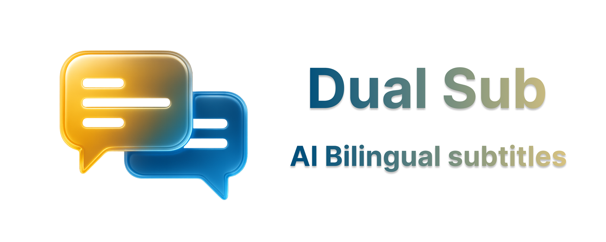

# DualSub - Dual Language Subtitles for Streaming

<p align="center">
  
</p>

[中文版 | Chinese Version](README_zh.md)


[](https://deepwiki.com/QuellaMC/DualSub)
[](https://chrome.google.com/webstore/detail/lnkcpcbpjbidpjdjnmjdllpkgpocaikj)

**DualSub** is a powerful Chrome extension that enhances your streaming experience by displaying dual language subtitles simultaneously. Perfect for language learning, accessibility, or simply enjoying content in multiple languages at once.

## 📚 Documentation

- [Features](docs/en/features.md)
- [Supported Platforms](docs/en/platforms.md)
- [Translation Providers](docs/en/providers.md)
- [AI Context Analysis](docs/en/ai-context.md)
- [Installation](docs/en/installation.md)
- [Configuration](docs/en/configuration.md)

## 📋 Table of Contents

- [Documentation](#-documentation)
- [Highlights](#-highlights)
- [Installation & Quick Start](#-installation--quick-start)
- [Development Setup](#-development-setup)
- [Architecture](#-architecture)
- [Contributing](#-contributing)
- [Testing](#-testing)
- [License](#-license)
- [Changelog](#-changelog)

## ✨ Highlights

- Dual subtitles on Netflix and Disney+
- Multiple translation providers with smart fallback and batching
- AI Context Analysis (OpenAI, Google Gemini)
- Flexible layouts, appearance controls, and timing offset
- Multi-language UI (EN, ES, JA, KO, ZH-CN, ZH-TW)

See details in: [docs/en/features.md](docs/en/features.md), [docs/en/platforms.md](docs/en/platforms.md), [docs/en/providers.md](docs/en/providers.md).

## 📦 Installation & Quick Start

1. Install from the Chrome Web Store or load unpacked (see `docs/en/installation.md`).
2. Open Netflix or Disney+ and enable subtitles.
3. Click the DualSub icon → enable dual subtitles and choose target language.
4. Optional: Configure AI Context (provider, API key, model) in Advanced Settings.

Configuration reference: [docs/en/configuration.md](docs/en/configuration.md). AI docs: [docs/en/ai-context.md](docs/en/ai-context.md).

### Configuration Examples

**For Language Learning:**

```
Translation Provider: DeepL Free
Layout: Top/Bottom
Display Order: Original First
Font Size: Large
AI Context: Enabled (OpenAI GPT-4.1 Mini)
Context Types: Cultural, Historical, Linguistic
```

**For Performance:**

```
Translation Batch Size: 5
Request Delay: 100ms
Translation Provider: Google Translate
AI Context: Enabled (Google Gemini Flash)
Context Cache: Enabled
```

**For Advanced Users:**

```
Translation Provider: OpenAI Compatible
AI Context Provider: OpenAI GPT-4.1 Mini
Context Types: All
Rate Limit: 60 requests/minute
Cache TTL: 1 hour
Debug Logging: Enabled
```

## 🛠️ Development Setup

### Prerequisites

- **Node.js** 18+ and npm
- **Google Chrome** with Developer mode enabled
- **Git** for version control

### Setup Instructions

1. **Clone and Install**

    ```bash
    git clone https://github.com/QuellaMC/DualSub.git
    cd DualSub
    npm install
    ```

2. **Development Commands**

    ```bash
    # Code formatting
    npm run format

    # Linting
    npm run lint
    npm run lint:fix

    # Testing
    npm test
    npm run test:watch
    ```

3. **Load Extension for Testing**
    - Follow manual installation steps above
    - Reload extension after making changes

### Project Structure

```
DualSub/
├── content_scripts/     # Platform-specific content scripts
├── translation_providers/ # Translation service implementations
├── services/           # Core services (config, logging)
├── popup/             # Extension popup interface
├── options/           # Advanced settings page
├── utils/             # Shared utilities
├── test-utils/        # Testing infrastructure
├── _locales/          # Internationalization files
└── icons/             # Extension icons
```

## 🏗️ Architecture

DualSub uses a modern, modular architecture built on several key design patterns:

### Core Architecture

- **📐 Template Method Pattern**: `BaseContentScript` provides common functionality with platform-specific implementations
- **🔌 Dependency Injection**: Dynamic module loading for better testability and loose coupling
- **📡 Event-Driven Design**: Extensible message handling with action-based routing
- **🧹 Resource Management**: Comprehensive cleanup system preventing memory leaks

### Key Components

- **Content Scripts**: Platform-specific implementations extending `BaseContentScript`
- **Translation Providers**: Modular translation services with automatic fallback
- **Configuration Service**: Centralized settings management with validation
- **Logging System**: Cross-context logging with configurable levels

For detailed technical documentation, see:

- [Architecture Overview](content_scripts/ARCHITECTURE.md)
- [API Reference](content_scripts/API_REFERENCE.md)
- [Platform Implementation Guide](content_scripts/PLATFORM_IMPLEMENTATION_GUIDE.md)

## 🤝 Contributing

We welcome contributions! Please follow these guidelines:

### Code Standards

- **ESLint + Prettier**: Code must pass linting and formatting checks
- **ES Modules**: Use modern JavaScript module syntax
- **Testing**: All new features require comprehensive tests
- **Documentation**: Update relevant documentation for changes

### Development Workflow

1. **Fork** the repository
2. **Create** a feature branch (`git checkout -b feature/amazing-feature`)
3. **Write** tests for your changes
4. **Ensure** all tests pass (`npm test`)
5. **Format** code (`npm run format`)
6. **Lint** code (`npm run lint:fix`)
7. **Commit** changes (`git commit -m 'Add amazing feature'`)
8. **Push** to branch (`git push origin feature/amazing-feature`)
9. **Open** a Pull Request

### Adding New Features

#### New Translation Providers

1. Create provider in `translation_providers/` directory
2. Implement `async function translate(text, sourceLang, targetLang)`
3. Add to `background.js` providers object
4. Update `popup/popup.js` and `options/options.js`
5. Add comprehensive tests

#### New Streaming Platforms

1. Extend `BaseContentScript` class
2. Implement required abstract methods
3. Create platform-specific configuration
4. Update `manifest.json` content scripts
5. Add platform tests

### Code Review Process

- All submissions require review
- Tests must pass CI/CD pipeline
- Documentation must be updated
- Breaking changes require discussion

## 🧪 Testing

DualSub includes a comprehensive testing framework:

### Running Tests

```bash
# Run all tests
npm test

# Watch mode for development
npm run test:watch

# Run specific test file
npm test -- background.test.js

# Run tests with coverage
npm test -- --coverage
```

### Test Structure

- **Unit Tests**: Individual component testing
- **Integration Tests**: Cross-component functionality
- **Mock Infrastructure**: Chrome API and DOM mocking
- **Test Utilities**: Shared testing helpers and fixtures

### Testing Guidelines

- **Coverage**: Aim for >80% code coverage
- **Isolation**: Tests should not depend on each other
- **Mocking**: Use provided mocks for Chrome APIs
- **Assertions**: Clear, descriptive test assertions

## 📄 License

This project is licensed under the **Creative Commons Attribution-NonCommercial-ShareAlike 4.0 International License (CC BY-NC-SA 4.0)**.

[](http://creativecommons.org/licenses/by-nc-sa/4.0/)

### License Summary

- ✅ **Share**: Copy and redistribute the material
- ✅ **Adapt**: Remix, transform, and build upon the material
- ❌ **Commercial Use**: Not permitted
- 📝 **Attribution**: Must give appropriate credit
- 🔄 **ShareAlike**: Must distribute under same license

For full license terms, see [LICENSE](LICENSE) file.

## 📋 Changelog

### Version 2.2.0 (Current)

- 🧩 Modularized documentation with English and Chinese docs under `docs/`
- 🧭 AI Context UI/UX refinements (modal, transitions, selection persistence)
- 🧹 Internal refactors and minor fixes

### Version 2.1.0

- 📍 Added vertical position control for precise subtitle placement on screen
- 🎨 Enhanced appearance customization with new positioning options
- ⚙️ Improved user interface with vertical position slider control

### Version 2.0.0 (Current)

- 🤖 **NEW**: AI Context Analysis feature with OpenAI and Google Gemini support
- 🎯 Interactive subtitle text selection with cultural, historical, and linguistic explanations
- 🔑 Comprehensive API key management and provider configuration
- 🚀 Implemented universal batch translation system for improved performance
- ⚡ Added provider-specific batch size optimization (80-90% reduction in API calls)
- 🔧 Enhanced translation efficiency with intelligent batching and delimiter approach
- 📊 Improved subtitle processing with configurable batch sizes and concurrent processing
- 🧠 Advanced caching and rate limiting for AI context requests

### Version 1.5.0

- 🚀 Implemented universal batch translation system for improved performance
- ⚡ Added provider-specific batch size optimization (80-90% reduction in API calls)
- 🔧 Enhanced translation efficiency with intelligent batching and delimiter approach
- 📊 Improved subtitle processing with configurable batch sizes and concurrent processing

### Version 1.4.0

- ✨ Added Netflix support with official subtitle integration
- 🔄 Implemented multiple translation providers with fallback
- 🌐 Added multi-language UI support (6 languages)
- ⚙️ Introduced advanced options page
- 🏗️ Refactored architecture with Template Method pattern
- 🧪 Added comprehensive testing framework
- 📊 Implemented configurable logging system
- 🔧 Enhanced configuration management

### Previous Versions

_For detailed version history, see [GitHub Releases](https://github.com/QuellaMC/DualSub/releases)_

---

## 📞 Support & Community

- **🐛 Bug Reports**: [GitHub Issues](https://github.com/QuellaMC/DualSub/issues)
- **💡 Feature Requests**: [GitHub Discussions](https://github.com/QuellaMC/DualSub/discussions)
- **📖 Documentation**: [Wiki](https://github.com/QuellaMC/DualSub/wiki)

---

**⚠️ Disclaimer**: This extension is not officially affiliated with Netflix, Disney+, or any streaming platform. All trademarks belong to their respective owners.
