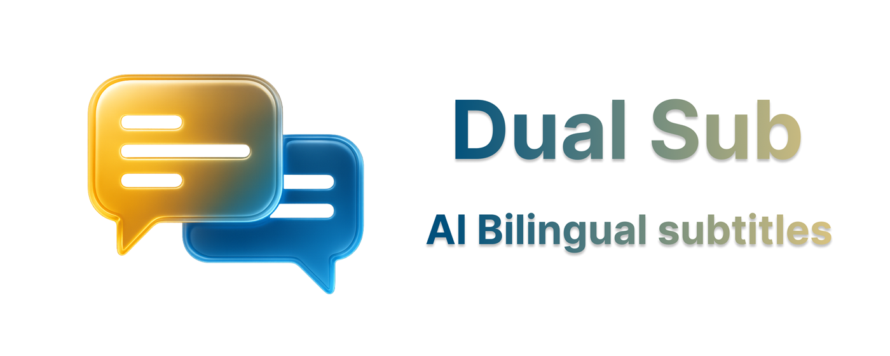

# DualSub - 流媒体双语字幕扩展

<p align="center">
  
</p>

[English Version | 英文版](README.md)


[](https://deepwiki.com/QuellaMC/DualSub)
[](https://chrome.google.com/webstore/detail/lnkcpcbpjbidpjdjnmjdllpkgpocaikj)

**DualSub** 是一个强大的 Chrome 扩展，通过同时显示双语字幕来增强您的流媒体观看体验。非常适合语言学习、无障碍访问，或者只是想同时享受多种语言的内容。

## 📚 文档

- **功能特性**：[features.md](docs/zh/features.md)
- **支持的平台**：[platforms.md](docs/zh/platforms.md)
- **翻译服务商**：[providers.md](docs/zh/providers.md)
- **AI 上下文分析**：[ai-context.md](docs/zh/ai-context.md)
- **安装说明**：[installation.md](docs/zh/installation.md)
- **配置设置**：[configuration.md](docs/zh/configuration.md)

## 📋 目录

- [功能特性](#-功能特性)
- [支持的平台](#-支持的平台)
- [翻译服务商](#-翻译服务商)
- [AI 上下文分析](#-ai-上下文分析)
- [安装说明](#-安装说明)
- [快速开始](#-快速开始)
- [配置设置](#-配置设置)
- [开发环境设置](#-开发环境设置)
- [架构设计](#-架构设计)
- [贡献指南](#-贡献指南)
- [测试](#-测试)
- [许可证](#-许可证)
- [更新日志](#-更新日志)

## ✨ 亮点

- 双语字幕：同时显示原文与翻译
- 多平台支持：Netflix、Disney+
- 多服务商：Google、Microsoft、DeepL、OpenAI 兼容（自动回退与批处理）
- 自定义：布局、外观、垂直位置、时间偏移
- AI 上下文：OpenAI 与 Gemini，文化/历史/语言解读

更多细节：[features.md](docs/zh/features.md)、[platforms.md](docs/zh/platforms.md)、[providers.md](docs/zh/providers.md)、[ai-context.md](docs/zh/ai-context.md)。

## 📦 安装与快速开始

1. 从商店安装或以开发模式加载（见 [installation.md](docs/zh/installation.md)）。
2. 打开 Netflix 或 Disney+ 并启用字幕。
3. 点击 DualSub 图标 → 启用双语字幕并选择目标语言。
4. 可选：在“高级设置”中配置 AI 上下文（服务商、API 密钥、模型）。

配置参考：[configuration.md](docs/zh/configuration.md)。

## 🛠️ 开发环境设置

### 先决条件

- **Node.js** 18+ 和 npm
- **Google Chrome** 启用开发者模式
- **Git** 用于版本控制

### 设置说明

1. **克隆和安装**

    ```bash
    git clone https://github.com/QuellaMC/DualSub.git
    cd DualSub
    npm install
    ```

2. **开发命令**

    ```bash
    # 代码格式化
    npm run format

    # 代码检查
    npm run lint
    npm run lint:fix

    # 测试
    npm test
    npm run test:watch
    ```

3. **加载扩展进行测试**
    - 按照上述手动安装步骤
    - 更改后重新加载扩展

### 项目结构

```
DualSub/
├── content_scripts/     # 平台特定的内容脚本
├── translation_providers/ # 翻译服务实现
├── services/           # 核心服务（配置、日志）
├── popup/             # 扩展弹出界面
├── options/           # 高级设置页面
├── utils/             # 共享工具
├── test-utils/        # 测试基础设施
├── _locales/          # 国际化文件
└── icons/             # 扩展图标
```

## 🏗️ 架构设计

DualSub 使用基于几个关键设计模式的现代模块化架构：

### 核心架构

- **📐 模板方法模式**：`BaseContentScript` 提供通用功能，具有平台特定实现
- **🔌 依赖注入**：动态模块加载，提高可测试性和松耦合
- **📡 事件驱动设计**：具有基于操作路由的可扩展消息处理
- **🧹 资源管理**：全面的清理系统，防止内存泄漏

### 关键组件

- **内容脚本**：扩展 `BaseContentScript` 的平台特定实现
- **翻译服务商**：具有自动回退的模块化翻译服务
- **配置服务**：具有验证的集中设置管理
- **日志系统**：具有可配置级别的跨上下文日志记录

有关详细的技术文档，请参阅：

- [架构概述](content_scripts/ARCHITECTURE.md)
- [API 参考](content_scripts/API_REFERENCE.md)
- [平台实现指南](content_scripts/PLATFORM_IMPLEMENTATION_GUIDE.md)

## 🤝 贡献指南

我们欢迎贡献！请遵循以下指导原则：

### 代码标准

- **ESLint + Prettier**：代码必须通过代码检查和格式化检查
- **ES 模块**：使用现代 JavaScript 模块语法
- **测试**：所有新功能都需要全面的测试
- **文档**：为更改更新相关文档

### 开发工作流程

1. **Fork** 仓库
2. **创建**功能分支（`git checkout -b feature/amazing-feature`）
3. **编写**更改的测试
4. **确保**所有测试通过（`npm test`）
5. **格式化**代码（`npm run format`）
6. **检查**代码（`npm run lint:fix`）
7. **提交**更改（`git commit -m 'Add amazing feature'`）
8. **推送**到分支（`git push origin feature/amazing-feature`）
9. **打开** Pull Request

### 添加新功能

#### 新翻译服务商

1. 在 `translation_providers/` 目录中创建服务商
2. 实现 `async function translate(text, sourceLang, targetLang)`
3. 添加到 `background.js` 服务商对象
4. 更新 `popup/popup.js` 和 `options/options.js`
5. 添加全面的测试

#### 新流媒体平台

1. 扩展 `BaseContentScript` 类
2. 实现所需的抽象方法
3. 创建平台特定配置
4. 更新 `manifest.json` 内容脚本
5. 添加平台测试

### 代码审查流程

- 所有提交都需要审查
- 测试必须通过 CI/CD 管道
- 必须更新文档
- 破坏性更改需要讨论

## 🧪 测试

DualSub 包含一个全面的测试框架：

### 运行测试

```bash
# 运行所有测试
npm test

# 开发的监视模式
npm run test:watch

# 运行特定测试文件
npm test -- background.test.js

# 运行带覆盖率的测试
npm test -- --coverage
```

### 测试结构

- **单元测试**：单个组件测试
- **集成测试**：跨组件功能
- **模拟基础设施**：Chrome API 和 DOM 模拟
- **测试工具**：共享测试助手和固定装置

### 测试指导原则

- **覆盖率**：目标 >80% 代码覆盖率
- **隔离**：测试不应相互依赖
- **模拟**：为 Chrome API 使用提供的模拟
- **断言**：清晰、描述性的测试断言

## 📄 许可证

本项目根据 **知识共享署名-非商业性使用-相同方式共享 4.0 国际许可协议（CC BY-NC-SA 4.0）** 获得许可。

[](http://creativecommons.org/licenses/by-nc-sa/4.0/)

### 许可证摘要

- ✅ **共享**：复制和重新分发材料
- ✅ **改编**：重新混合、转换和基于材料构建
- ❌ **商业用途**：不允许
- 📝 **署名**：必须给予适当的信用
- 🔄 **相同方式共享**：必须在相同许可证下分发

有关完整的许可证条款，请参阅 [LICENSE](LICENSE) 文件。

## 📋 更新日志

### 版本 2.3.1（当前）

- 🧠 Netflix 下一集预加载字幕：在导航前捕获并缓存下一集的字幕数据，在 SPA 路由切换后立即应用，修复“下一集”后字幕未更新的问题。
- 🧩 通用改进：内容脚本在 URL 变化时通知平台，为跨平台的预加载处理打下基础。

### 版本 2.3.0

- 🛠️ Netflix 软导航修复：修复在切换到下一集（SPA 导航）时仍显示上一集字幕的问题。现在会重置并绑定到新视频上下文。
- 🎯 Disney+ 进度条更新：适配网站最新 UI，直接从 progress-bar 组件的 shadow DOM 读取 aria 属性以确保时间同步准确。

### 版本 2.2.0

- 🧩 英中双语模块化文档，新增 `docs/` 目录
- 🧭 AI 上下文交互改进（模态、过渡、选择持久化）
- 🧹 内部重构与若干修复

### 版本 2.1.0

- 📍 添加了垂直位置控制，可精确控制字幕在屏幕上的位置
- 🎨 通过新的定位选项增强外观自定义功能
- ⚙️ 通过垂直位置滑块控制改进用户界面

### 版本 2.0.0（当前）

- 🤖 **新功能**：AI 上下文分析功能，支持 OpenAI 和 Google Gemini
- 🎯 交互式字幕文本选择，提供文化、历史和语言解释
- 🔑 全面的 API 密钥管理和服务商配置
- 🚀 实现了通用批量翻译系统以提高性能
- ⚡ 添加了服务商特定的批处理大小优化（API 调用减少 80-90%）
- 🔧 通过智能批处理和分隔符方法增强翻译效率
- 📊 通过可配置的批处理大小和并发处理改进字幕处理
- 🧠 AI 上下文请求的高级缓存和速率限制

### 版本 1.5.0

- 🚀 实现了通用批量翻译系统以提高性能
- ⚡ 添加了服务商特定的批处理大小优化（API 调用减少 80-90%）
- 🔧 通过智能批处理和分隔符方法增强翻译效率
- 📊 通过可配置的批处理大小和并发处理改进字幕处理

### 版本 1.4.0

- ✨ 添加了 Netflix 支持和官方字幕集成
- 🔄 实现了具有回退功能的多个翻译服务商
- 🌐 添加了多语言界面支持（6 种语言）
- ⚙️ 引入了高级选项页面
- 🏗️ 使用模板方法模式重构架构
- 🧪 添加了全面的测试框架
- 📊 实现了可配置的日志系统
- 🔧 增强了配置管理

### 以前的版本

_有关详细的版本历史，请参阅 [GitHub 发布](https://github.com/QuellaMC/DualSub/releases)_

---

## 📞 支持与社区

- **🐛 错误报告**：[GitHub Issues](https://github.com/QuellaMC/DualSub/issues)
- **💡 功能请求**：[GitHub Discussions](https://github.com/QuellaMC/DualSub/discussions)
- **📖 文档**：[Wiki](https://github.com/QuellaMC/DualSub/wiki)

---

**⚠️ 免责声明**：此扩展与 Netflix、Disney+ 或任何流媒体平台没有官方关联。所有商标均属于其各自所有者。
