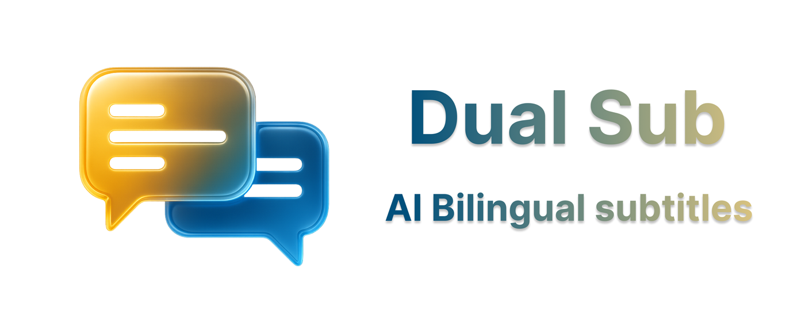

# DualSub - 流媒体双语字幕扩展

<p align="center">
  
</p>

[English Version | 英文版](README.md)


[](https://deepwiki.com/QuellaMC/DualSub)
[](https://chrome.google.com/webstore/detail/lnkcpcbpjbidpjdjnmjdllpkgpocaikj)

**DualSub** 是一个强大的 Chrome 扩展，通过同时显示双语字幕来增强您的流媒体观看体验。非常适合语言学习、无障碍访问，或者只是想同时享受多种语言的内容。

## 📚 文档

- **功能特性**：[features.md](docs/zh/features.md)
- **支持的平台**：[platforms.md](docs/zh/platforms.md)
- **翻译服务商**：[providers.md](docs/zh/providers.md)
- **AI 上下文分析**：[ai-context.md](docs/zh/ai-context.md)
- **安装说明**：[installation.md](docs/zh/installation.md)
- **配置设置**：[configuration.md](docs/zh/configuration.md)

## 📋 目录

- [功能特性](#-功能特性)
- [支持的平台](#-支持的平台)
- [翻译服务商](#-翻译服务商)
- [AI 上下文分析](#-ai-上下文分析)
- [安装说明](#-安装说明)
- [快速开始](#-快速开始)
- [配置设置](#-配置设置)
- [开发环境设置](#-开发环境设置)
- [架构设计](#-架构设计)
- [贡献指南](#-贡献指南)
- [测试](#-测试)
- [许可证](#-许可证)
- [更新日志](#-更新日志)

## ✨ 亮点

- 双语字幕：同时显示原文与翻译
- 多平台支持：Netflix、Disney+
- 多服务商：Google、Microsoft、DeepL、OpenAI 兼容（含速率限制与缓存）
- 自定义：布局、外观、垂直位置、时间偏移
- AI 上下文：OpenAI 与 Gemini，文化/历史/语言解读

更多细节：[features.md](docs/zh/features.md)、[platforms.md](docs/zh/platforms.md)、[providers.md](docs/zh/providers.md)、[ai-context.md](docs/zh/ai-context.md)。

## 📦 安装与快速开始

1. 从商店安装或以开发模式加载（见 [installation.md](docs/zh/installation.md)）。
2. 打开 Netflix 或 Disney+ 并启用字幕。
3. 点击 DualSub 图标 → 启用双语字幕并选择目标语言。
4. 可选：在“高级设置”中配置 AI 上下文（服务商、API 密钥、模型）。

配置参考：[configuration.md](docs/zh/configuration.md)。

## 🛠️ 开发环境设置

### 先决条件

- **Node.js** 24 LTS 和 npm 11+
- **Google Chrome** 116+ 并启用开发者模式
- **Git** 用于版本控制

### 设置说明

1. **克隆和安装**

    ```bash
    git clone https://github.com/QuellaMC/DualSub.git
    cd DualSub
    npm ci
    ```

2. **开发命令**

    ```bash
    # 类型检查、代码检查与格式校验
    npm run compile
    npm run lint
    npm run format:check

    # 测试：单次、监视模式，或带覆盖率下限
    npm test
    npm run test:watch
    npm run test:coverage

    # 生产构建、发布压缩包与压缩包审计
    npm run build
    npm run zip
    npm run verify:release
    ```

3. **加载扩展进行测试**
    - 运行 `npm run build`（或 `npm run dev` 实现修改后自动重新构建）
    - 打开 `chrome://extensions`，开启"开发者模式"，点击"加载已解压的扩展程序"，选择 `.output/chrome-mv3`
    - 每次构建后重新加载扩展

### 项目结构

```
DualSub/
├── src/
│   ├── entrypoints/    # 后台 worker、内容脚本、弹窗、设置页、侧边栏
│   ├── background/     # 字幕管线、翻译、AI 上下文、侧边栏权威
│   ├── content/        # 页面桥、播放会话、渲染、选词、平台适配器
│   ├── messaging/      # 跨上下文契约、路由、客户端、发送方鉴别
│   ├── config/         # 设置模式、存储服务、迁移
│   ├── shared/         # 日志、请求加固、服务商常量
│   ├── ui/             # React 弹窗、设置页、侧边栏与共享 hooks
│   ├── build/          # manifest 快照与语言包一致性测试
│   └── test-utils/     # 测试辅助
├── public/             # 语言包与图标
├── scripts/            # 发布校验
├── docs/               # 用户文档（en、zh）与参考资料
└── wxt.config.ts       # manifest 与构建配置（WXT）
```

## 🏗️ 架构设计

DualSub 3 是基于 WXT、React 19、zod 与 Vitest 的 TypeScript 扩展。

### 核心架构

- **每个视频一个会话**：内容编排器只为当前路由上的视频保留一个播放会话，会话中的每个监听器、定时器与请求都随同一个中止信号结束
- **页面桥**：声明式注册的主世界脚本直接从平台播放器读取字幕轨道，并通过消息通道与隔离世界通信
- **契约优先的消息**：每条跨上下文消息都是 zod 契约；路由先快照载荷、鉴别发送方、按角色放行、再解析，最后才交给类型化处理器
- **后台服务**：带 CDN 白名单与字节上限的字幕管线、按服务商限速并缓存的翻译服务、失败即关闭的 AI 上下文服务，以及让内容脚本始终成为选词唯一真相的侧边栏权威

### 关键组件

- **平台适配器**（`src/content/platform/`）：Netflix 与 Disney+ 的差异收敛在同一接口之后
- **翻译服务商**（`src/background/translation/providers/`）：所有服务商共用一套错误分类与限速机制
- **配置服务**（`src/config/`）：类型化设置模式、严格读取、凭据仅存本机、幂等迁移
- **侧边栏**（`src/ui/sidepanel/`、`src/background/sidepanel/`）：带两阶段移除的选词同步

参考资料：[审计报告](docs/reference/pr62-audit-report.html)、[冒烟测试清单](docs/reference/smoke-protocol.md)、[商店审核说明](docs/reference/store-review-notes.md)。

## 🤝 贡献指南

我们欢迎贡献！请遵循以下指导原则：

### 代码标准

- **ESLint + Prettier**：代码必须通过代码检查和格式化检查
- **ES 模块**：使用现代 JavaScript 模块语法
- **测试**：所有新功能都需要全面的测试
- **文档**：为更改更新相关文档

### 开发工作流程

1. **Fork** 仓库
2. **创建**功能分支（`git checkout -b feature/amazing-feature`）
3. **编写**更改的测试
4. **确保**所有测试通过（`npm test`）
5. **格式化**代码（`npm run format`）
6. **检查**代码（`npm run lint:fix`）
7. **提交**更改（`git commit -m 'Add amazing feature'`）
8. **推送**到分支（`git push origin feature/amazing-feature`）
9. **打开** Pull Request

### 添加新功能

#### 新翻译服务商

1. 在 `src/background/translation/providers/` 下新增实现 `TranslationProvider` 的模块
2. 在 `providers/index.ts` 注册，并把 id 加入 `src/shared/providers.ts` 的 `PROVIDER_IDS`
3. 在 `src/ui/options/providers/` 添加设置卡片，并为 `public/_locales/` 中的每个语言包补充文案
4. 在模块旁添加测试

#### 新流媒体平台

1. 在 `src/content/platform/` 下新增描述符与适配器
2. 在 `src/entrypoints/` 声明其内容脚本
3. 为其 CDN 扩展 `src/background/subtitle/` 中的策略与解析器
4. 在说明变更原因的提交中更新 `src/build/manifest.golden.json`
5. 在该平台上执行冒烟测试清单

### 代码审查流程

- 所有提交都需要审查
- 测试必须通过 CI/CD 管道
- 必须更新文档
- 破坏性更改需要讨论

## 🧪 测试

DualSub 包含一个全面的测试框架：

### 运行测试

```bash
# 运行所有测试
npm test

# 开发的监视模式
npm run test:watch

# 运行某个目录或文件
npm test -- src/config

# 运行带覆盖率的测试
npm run test:coverage
```

### 测试结构

- **单元测试**：单个组件测试
- **集成测试**：跨组件功能
- **模拟基础设施**：Chrome API 和 DOM 模拟
- **测试工具**：共享测试助手和固定装置

### 测试指导原则

- **覆盖率**：保持 CI 覆盖率门槛通过，并为变更行为补充针对性回归测试
- **隔离**：测试不应相互依赖
- **模拟**：为 Chrome API 使用提供的模拟
- **断言**：清晰、描述性的测试断言

## 📄 许可证

本项目根据 **知识共享署名-非商业性使用-相同方式共享 4.0 国际许可协议（CC BY-NC-SA 4.0）** 获得许可。

[](http://creativecommons.org/licenses/by-nc-sa/4.0/)

### 许可证摘要

- ✅ **共享**：复制和重新分发材料
- ✅ **改编**：重新混合、转换和基于材料构建
- ❌ **商业用途**：不允许
- 📝 **署名**：必须给予适当的信用
- 🔄 **相同方式共享**：必须在相同许可证下分发

有关完整的许可证条款，请参阅 [LICENSE](LICENSE) 文件。

## 📋 更新日志

### 版本 3.0.0（当前）

- 🏗️ **从零重建**：TypeScript + WXT，契约优先的消息机制，每个视频一个播放会话
- 🎬 **Netflix 播放器 API**：字幕轨道直接来自播放器，因此在 Netflix 2026 年的播放器改动后仍可工作
- 🌐 **Microsoft 翻译**改用 Edge 的免令牌端点（微软已下线免费鉴权端点）
- 🤖 **侧边栏**：可点击的单词、选词同步、AI 分析并在面板中显示失败原因
- 🔒 凭据不离开本机、服务商请求不携带浏览器 Cookie、AI 限速在 worker 重启后依然有效

### 版本 2.5.0

- 🤖 **统一 AI 体验**：将 AI 上下文分析集成到侧边栏中，提供无缝、持久的工作空间。
- 🐛 **稳定性改进**：修复了切换视频或在侧边栏中取消选择单词时的不同步问题。
- ✨ **体验优化**：改进了单词选择排序，使其始终与句子结构匹配。

### 版本 2.4.0

- ⚛️ **React 迁移**：将弹出窗口和选项页面完全迁移到 React
- 🏗️ **现代化构建**：使用 Vite 进行快速开发和优化构建
- 🎨 **UI 改进**：组件化架构，更好的可维护性
- 📦 **构建系统**：自动化构建流程，GitHub Actions 集成
- ✅ **100% 功能对等**：保持所有现有功能和样式

### 版本 2.3.2

- 消息通信稳健性：重构消息工具，支持 callback 与 promise 双模式的 chrome.runtime.sendMessage，并在 MV3 后台休眠时进行唤醒重试。
- 平台适配统一化：在 BasePlatformAdapter 与 Netflix 中统一使用弹性消息发送，提升后台通信稳定性与测试确定性。
- AI 上下文：修正 Provider 指标统计（成功/失败），测试兼容回调/Promise 双模式；动态获取 chrome 防止测试间的旧 mock 引用。
- 内部重构与稳定性改进。

### 版本 2.3.1

- 🧠 Netflix 下一集预加载字幕：在导航前捕获并缓存下一集的字幕数据，在 SPA 路由切换后立即应用，修复“下一集”后字幕未更新的问题。
- 🧩 通用改进：内容脚本在 URL 变化时通知平台，为跨平台的预加载处理打下基础。

### 版本 2.3.0

- 🛠️ Netflix 软导航修复：修复在切换到下一集（SPA 导航）时仍显示上一集字幕的问题。现在会重置并绑定到新视频上下文。
- 🎯 Disney+ 进度条更新：适配网站最新 UI，直接从 progress-bar 组件的 shadow DOM 读取 aria 属性以确保时间同步准确。

### 版本 2.2.0

- 🧩 英中双语模块化文档，新增 `docs/` 目录
- 🧭 AI 上下文交互改进（模态、过渡、选择持久化）
- 🧹 内部重构与若干修复

### 版本 2.1.0

- 📍 添加了垂直位置控制，可精确控制字幕在屏幕上的位置
- 🎨 通过新的定位选项增强外观自定义功能
- ⚙️ 通过垂直位置滑块控制改进用户界面

### 版本 2.0.0

- 🤖 **新功能**：AI 上下文分析功能，支持 OpenAI 和 Google Gemini
- 🎯 交互式字幕文本选择，提供文化、历史和语言解释
- 🔑 全面的 API 密钥管理和服务商配置
- 🧠 AI 上下文请求的高级缓存和速率限制

### 版本 1.4.0

- ✨ 添加了 Netflix 支持和官方字幕集成
- 🔄 实现了具有回退功能的多个翻译服务商
- 🌐 添加了多语言界面支持（6 种语言）
- ⚙️ 引入了高级选项页面
- 🏗️ 使用模板方法模式重构架构
- 🧪 添加了全面的测试框架
- 📊 实现了可配置的日志系统
- 🔧 增强了配置管理

### 以前的版本

_有关详细的版本历史，请参阅 [GitHub 发布](https://github.com/QuellaMC/DualSub/releases)_

---

## 📞 支持与社区

- **🐛 错误报告**：[GitHub Issues](https://github.com/QuellaMC/DualSub/issues)
- **💡 功能请求**：[GitHub Discussions](https://github.com/QuellaMC/DualSub/discussions)
- **📖 文档**：[Wiki](https://github.com/QuellaMC/DualSub/wiki)

---

**⚠️ 免责声明**：此扩展与 Netflix、Disney+ 或任何流媒体平台没有官方关联。所有商标均属于其各自所有者。
